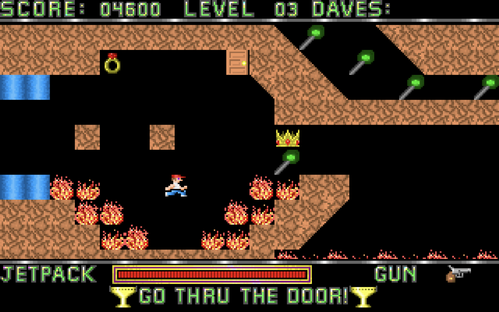

# Deadly Dave



## Overview

This is a replica of the classic game Dangerous Dave, built using the C programming language and the SDL (Simple DirectMedia Layer) library. It aims to recreate the nostalgic gameplay experience of the original while adding some modern twists.

## Features

- Classic 2D platformer gameplay.
- Pixel-perfect graphics reminiscent of the original.
- Challenging levels and enemies.
- Smooth animations and controls.
- Sound effects and background music.

## Getting Started

Follow these steps to compile and run the game on your system:

1. **Prerequisites**: Make sure you have SDL2 and any other necessary libraries installed on your system.

2. **Clone the Repository**: 
    ```sh
    git clone https://github.com/yourusername/dangerous-dave-replica.git
    cd dangerous-dave-replica
    ```

3. **Build the Game**:
    ```sh
   clang -std=c11 bullet.c dave.c game.c invfreq.c main.c monster.c plasma.c soundfx.c tile.c -I/Library/Frameworks/SDL2.framework/Headers -I/Library/Frameworks/SDL2_image.framework/Headers -F/Library/Frameworks -framework SDL2 -framework SDL2_image -o app

    ```

4. **Run the Game**:
    ```sh
    ./app
    ```

5. **Controls**:
    - Use the arrow keys to move Dave.
    - Press 'Space' to jump.
    - Press 'ctrl' to shoot.

## Screenshots


## Acknowledgments

- Thanks to John Romero for creating the original Dangerous Dave game.
- Thanks to the SDL development team for providing a fantastic library for game development.

